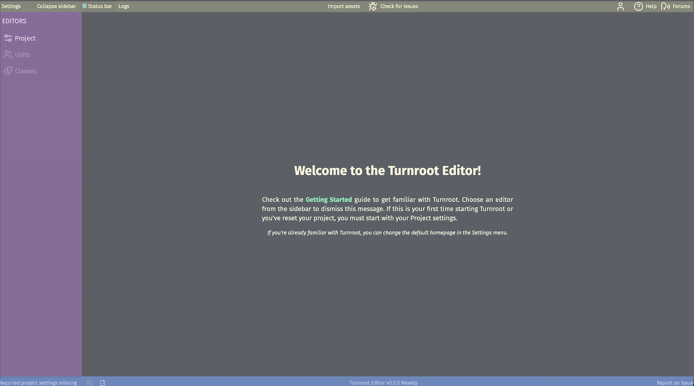

# Editor Basics
<figure markdown="span">
  { width="100%" }
  <figcaption></figcaption>
</figure>
The Turnroot Editor is laid out much like a traditional desktop application, with a top menu, sidebar, and status bar. This page will give you a brief overview of the Editor's layout and how to navigate it. Don't worry if you don't understand everything right away; you'll get the hang of it as you use the Editor more. The most important thing is the main editor and the __Sidebar__, which you'll use to move between different sub-editors.

## Top Menu (marked in yellow)
The __Top Menu__ is where you can access global settings, your account, check for errors, get help, and import assets.

- __Settings__
    - __Themes__: Change the color scheme of the Editor.
    - __Startup View__: Choose which editor you see when you open the Editor.
- __Collapse Sidebar__: Toggle the sidebar to give yourself more room to work.
- __Status Bar__: Toggle the status bar.
- __Logs__: View logs from the Editor.
- __Import Assets__: Import assets into the Editor.
- __Check For Issues__: Check for issues- such as broken, missing, or invalid data- in your game. Once you've resolved all issues, this button will change to  __Test__. You'll then be able to click __Test__ to test parts of your game. If you make changes, this will change back to __Check For Issues__, and you'll be able to repeat the process.
- __Profile__ (the user icon): Logout, reset password, change username, switch to a team project, or view your account information.
- __Help__: Opens the documentation in a new tab.
- __Forums__: Opens the Turnroot community forums in a new tab.

Once you've set up your initial game settings in the Project sub-editor, one more button will appear in the Top Menu, next to __Check For Issues__; __Invite Collaborators__ (the user icon with a plus symbol). This will allow you to invite other people to work on your game with you. This is a advanced topic beyond the scope of this overview; read more about it in the [Collaboration](../collaboration/index.md) section.

## Sidebar (marked in pink)
The __Sidebar__ is how you can move between different sub-editors in the Editor. For simplicity, these sub-editors are simply called "editors" through the documentation. 

You can find more information about the Sidebar in the [Sidebar](../navigating/sidebar.md) section. 

## Status Bar (marked in blue)
If you haven't yet set the initial game settings in the Project sub-editor, the first item in the __Status Bar__ will be a warning note. Once you've set the initial game settings, the warning will disappear.

- __Save Status__: If this shows a checkmark, your data is saved. If it shows an upward-pointing arrow, your data is being saved. Autosave will save your data every couple minutes. You can also manually save, if you want, though it's not necessary.
- __Turnroot Editor Version__: Shows the version of the Editor you're using. This is mostly for local installations, as the cloud Editor will always be up-to-date.
- __Report Issue__: If you encounter a bug, please report it here.

## Editor
The main area of the Editor is the __Editor__ itself. The Editor is divided into sub-editors, which you can switch between using the __Sidebar__.
